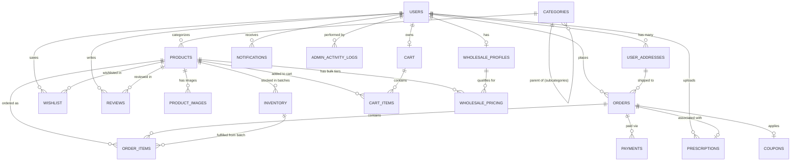

# Genekon Pharmacy Ecommerce — Database Architecture Specification

> **Target Environment**: PostgreSQL 16+ on [Neon Serverless Database](https://neon.tech)  
> **ORM Layer**: [Drizzle ORM](https://orm.drizzle.team)  
> **Architecture Scope**: B2C Retail Pharmacy Ecommerce + B2B Polyclinic & Hospital Wholesale + Pharmacist Admin Console  

---

## 1. System Overview & Architectural Objectives

The Genekon platform requires a resilient, legally compliant relational database architecture supporting:
1. **B2C Retail Pharmacy**: Prescription verification workflows, scheduled drug tracking, address books, cart, wishlists, offers, and payment reconciliation.
2. **B2B Wholesale Procurement**: Form 20B/21B drug license validation, GSTIN validation, minimum order quantities (MOQs), and tiered bulk pricing matrices.
3. **Dispensary & Pharmacist Administration**: Batch-level inventory tracking with **FEFO (First-Expiry, First-Out)** fulfillment, immutable order history snapshots, prescription review sign-offs, and compliance audit logging.
4. **Neon Cloud Capabilities**: Automatic connection pooling via PgBouncer, zero-downtime schema migrations via branch-first development, and scale-to-zero efficiency.

---

## 2. Complete Database Entity Relationship (ER) Diagram



---

## 3. Entity Specifications & Field Dictionary

### 1. `users`
Core user account registry across all three actors: Customer, Wholesale Partner, and Dispensary Administrator.

| Column | Data Type | Constraints | Description |
| :--- | :--- | :--- | :--- |
| `id` | `uuid` | `PRIMARY KEY`, `defaultRandom()` | System unique identifier |
| `name` | `varchar(150)` | `NOT NULL` | Full legal / display name |
| `email` | `varchar(255)` | `UNIQUE`, `NOT NULL` | Registered email |
| `phone` | `varchar(20)` | `UNIQUE`, `NOT NULL` | Mobile number for OTP & WhatsApp notifications |
| `password_hash` | `varchar(255)` | `NULL` | Bcrypt hash (null if Neon Auth / OAuth only) |
| `auth_provider_id` | `varchar(255)` | `NULL` | Neon Auth / Google OAuth subject ID |
| `role` | `user_role_enum` | `NOT NULL`, `DEFAULT 'CUSTOMER'` | `'CUSTOMER' \| 'WHOLESALE_PARTNER' \| 'ADMIN'` |
| `profile_details` | `jsonb` | `DEFAULT '{}'` | Extensible metadata (avatar, DOB, gender) |
| `is_active` | `boolean` | `NOT NULL`, `DEFAULT true` | Account active status |
| `created_at` | `timestamptz` | `NOT NULL`, `defaultNow()` | Registration timestamp |
| `updated_at` | `timestamptz` | `NOT NULL`, `defaultNow()` | Profile modification timestamp |

---

### 2. `user_addresses`
Customer and clinic delivery locations.

| Column | Data Type | Constraints | Description |
| :--- | :--- | :--- | :--- |
| `id` | `uuid` | `PRIMARY KEY`, `defaultRandom()` | Address ID |
| `user_id` | `uuid` | `FK -> users.id (CASCADE)` | Address owner |
| `full_name` | `varchar(150)` | `NOT NULL` | Contact recipient |
| `phone` | `varchar(20)` | `NOT NULL` | Contact phone |
| `address_line` | `text` | `NOT NULL` | Flat / Road / Street details |
| `landmark` | `varchar(150)` | `NULL` | Nearby hospital, school, or landmark |
| `city` | `varchar(100)` | `NOT NULL` | City name |
| `state` | `varchar(100)` | `NOT NULL` | State name |
| `pincode` | `varchar(10)` | `NOT NULL` | Postal PIN code |
| `address_type` | `address_type_enum` | `NOT NULL`, `DEFAULT 'HOME'` | `'HOME' \| 'WORK' \| 'CLINIC' \| 'OTHER'` |
| `is_default` | `boolean` | `NOT NULL`, `DEFAULT false` | Default delivery address flag |
| `created_at` | `timestamptz` | `NOT NULL`, `defaultNow()` | Creation timestamp |
| `updated_at` | `timestamptz` | `NOT NULL`, `defaultNow()` | Update timestamp |

---

### 3. `categories`
Hierarchical category tree with subcategories support.

| Column | Data Type | Constraints | Description |
| :--- | :--- | :--- | :--- |
| `id` | `uuid` | `PRIMARY KEY`, `defaultRandom()` | Category ID |
| `name` | `varchar(100)` | `NOT NULL` | Category name |
| `slug` | `varchar(120)` | `UNIQUE`, `NOT NULL` | URL friendly slug |
| `image` | `varchar(500)` | `NULL` | Category banner / thumbnail URL |
| `parent_category_id`| `uuid` | `FK -> categories.id (SET NULL)`| Self-referencing subcategory parent |
| `display_order` | `integer` | `NOT NULL`, `DEFAULT 0` | Display sorting priority |
| `is_active` | `boolean` | `NOT NULL`, `DEFAULT true` | Category visibility flag |
| `created_at` | `timestamptz` | `NOT NULL`, `defaultNow()` | Creation timestamp |
| `updated_at` | `timestamptz` | `NOT NULL`, `defaultNow()` | Update timestamp |

---

### 4. `products`
Clinical medicine catalog with pharmaceutical specifications and regulatory tags.

| Column | Data Type | Constraints | Description |
| :--- | :--- | :--- | :--- |
| `id` | `uuid` | `PRIMARY KEY`, `defaultRandom()` | Product ID |
| `name` | `varchar(255)` | `NOT NULL` | Commercial brand trade name |
| `slug` | `varchar(280)` | `UNIQUE`, `NOT NULL` | Canonical product slug |
| `brand` | `varchar(150)` | `NOT NULL` | Brand / Marketing division |
| `manufacturer` | `varchar(200)` | `NOT NULL` | Manufacturing pharmaceutical lab |
| `category_id` | `uuid` | `FK -> categories.id (RESTRICT)` | Primary category |
| `description` | `text` | `NOT NULL` | Detailed medicine overview |
| `composition` | `text` | `NOT NULL` | Active chemical ingredients & strength |
| `dosage_form` | `varchar(100)` | `NOT NULL` | Packaging form (e.g. "Strip of 10 Tablets") |
| `usage` | `text` | `NOT NULL` | Indication & usage directions |
| `precautions` | `text` | `NOT NULL` | Safety warnings, contraindications |
| `storage_instructions`| `varchar(255)`| `NOT NULL` | Recommended temperature / moisture |
| `mrp` | `numeric(10,2)`| `NOT NULL` | Maximum Retail Price |
| `selling_price`| `numeric(10,2)`| `NOT NULL` | Consumer discounted selling price |
| `discount` | `numeric(5,2)` | `NOT NULL`, `DEFAULT 0` | Discount percentage (0.00 to 100.00) |
| `gst` | `numeric(5,2)` | `NOT NULL`, `DEFAULT 12.00` | Tax percentage (0%, 5%, 12%, 18%) |
| `sku` | `varchar(60)` | `UNIQUE`, `NOT NULL` | Stock Keeping Unit code |
| `prescription_required`| `boolean` | `NOT NULL`, `DEFAULT false` | Prescription requirement flag |
| `status` | `product_status_enum`| `NOT NULL`, `DEFAULT 'ACTIVE'`| `'ACTIVE' \| 'DRAFT' \| 'ARCHIVED' \| 'OUT_OF_STOCK'` |
| `created_at` | `timestamptz` | `NOT NULL`, `defaultNow()` | Creation timestamp |
| `updated_at` | `timestamptz` | `NOT NULL`, `defaultNow()` | Update timestamp |

---

### 5. `product_images`
Product photo gallery with display sequencing.

| Column | Data Type | Constraints | Description |
| :--- | :--- | :--- | :--- |
| `id` | `uuid` | `PRIMARY KEY`, `defaultRandom()` | Image ID |
| `product_id` | `uuid` | `FK -> products.id (CASCADE)` | Associated product |
| `image_url` | `varchar(500)` | `NOT NULL` | Image asset CDN URL |
| `alt_text` | `varchar(200)` | `NOT NULL` | Image alt description |
| `display_order` | `integer` | `NOT NULL`, `DEFAULT 0` | Order in gallery carousel |
| `is_primary` | `boolean` | `NOT NULL`, `DEFAULT false` | Default thumbnail flag |
| `created_at` | `timestamptz` | `NOT NULL`, `defaultNow()` | Creation timestamp |

---

### 6. `inventory`
Batch-specific inventory management for **FEFO (First-Expiry, First-Out)** compliance.

| Column | Data Type | Constraints | Description |
| :--- | :--- | :--- | :--- |
| `id` | `uuid` | `PRIMARY KEY`, `defaultRandom()` | Batch inventory ID |
| `product_id` | `uuid` | `FK -> products.id (RESTRICT)` | Product reference |
| `batch_number` | `varchar(50)` | `NOT NULL` | Batch/Lot number printed on packaging |
| `quantity` | `integer` | `NOT NULL`, `CHECK (quantity >= 0)` | Available physical units |
| `reserved_quantity`| `integer` | `NOT NULL`, `DEFAULT 0` | Units allocated to pending checkouts |
| `manufacturing_date`| `date` | `NOT NULL` | Date of manufacture |
| `expiry_date` | `date` | `NOT NULL` | Date of expiration (FEFO sorting key) |
| `created_at` | `timestamptz` | `NOT NULL`, `defaultNow()` | Addition timestamp |
| `updated_at` | `timestamptz` | `NOT NULL`, `defaultNow()` | Stock adjustment timestamp |

---

### 7. `cart` & `cart_items`
Persistent user shopping baskets and items.

**Table: `cart`**
| Column | Data Type | Constraints | Description |
| :--- | :--- | :--- | :--- |
| `id` | `uuid` | `PRIMARY KEY`, `defaultRandom()` | Cart ID |
| `user_id` | `uuid` | `UNIQUE`, `FK -> users.id (CASCADE)` | User link (1-to-1) |
| `created_at` | `timestamptz` | `NOT NULL`, `defaultNow()` | Creation timestamp |
| `updated_at` | `timestamptz` | `NOT NULL`, `defaultNow()` | Modification timestamp |

**Table: `cart_items`**
| Column | Data Type | Constraints | Description |
| :--- | :--- | :--- | :--- |
| `id` | `uuid` | `PRIMARY KEY`, `defaultRandom()` | Cart item ID |
| `cart_id` | `uuid` | `FK -> cart.id (CASCADE)` | Cart foreign key |
| `product_id` | `uuid` | `FK -> products.id (CASCADE)` | Product foreign key |
| `quantity` | `integer` | `NOT NULL`, `CHECK (quantity > 0)` | Item count |
| `price` | `numeric(10,2)`| `NOT NULL` | Unit price at time of addition |
| `created_at` | `timestamptz` | `NOT NULL`, `defaultNow()` | Addition timestamp |
| `updated_at` | `timestamptz` | `NOT NULL`, `defaultNow()` | Update timestamp |

---

### 8. `wishlist`
Product bookmarks for patients and accounts.

| Column | Data Type | Constraints | Description |
| :--- | :--- | :--- | :--- |
| `id` | `uuid` | `PRIMARY KEY`, `defaultRandom()` | Wishlist ID |
| `user_id` | `uuid` | `FK -> users.id (CASCADE)` | User foreign key |
| `product_id` | `uuid` | `FK -> products.id (CASCADE)` | Product foreign key |
| `created_at` | `timestamptz` | `NOT NULL`, `defaultNow()` | Timestamp added |
*(Unique constraint on `user_id` + `product_id`)*

---

### 9. `orders` & `order_items`
Order lifecycle, tax totals, and immutable address snapshots.

**Table: `orders`**
| Column | Data Type | Constraints | Description |
| :--- | :--- | :--- | :--- |
| `id` | `uuid` | `PRIMARY KEY`, `defaultRandom()` | Internal order ID |
| `user_id` | `uuid` | `FK -> users.id (RESTRICT)` | Customer reference |
| `order_number` | `varchar(30)` | `UNIQUE`, `NOT NULL` | Public order code (`GNK-829104`) |
| `subtotal` | `numeric(10,2)`| `NOT NULL` | Items total before discounts |
| `discount_amount` | `numeric(10,2)`| `NOT NULL`, `DEFAULT 0` | Product discount total |
| `coupon_id` | `uuid` | `NULL`, `FK -> coupons.id` | Applied coupon |
| `coupon_discount`| `numeric(10,2)`| `NOT NULL`, `DEFAULT 0` | Coupon savings amount |
| `delivery_fee` | `numeric(10,2)`| `NOT NULL`, `DEFAULT 0` | Courier shipping cost |
| `tax_amount` | `numeric(10,2)`| `NOT NULL`, `DEFAULT 0` | Cumulative GST tax |
| `total_amount` | `numeric(10,2)`| `NOT NULL` | Final amount payable |
| `payment_status` | `payment_status_enum`| `NOT NULL`, `DEFAULT 'PENDING'` | `'PENDING' \| 'PAID' \| 'FAILED' \| 'REFUNDED'` |
| `order_status` | `order_status_enum` | `NOT NULL`, `DEFAULT 'PLACED'` | `'PLACED' \| 'CONFIRMED' \| 'PACKED' \| 'SHIPPED' \| 'DELIVERED' \| 'CANCELLED'` |
| `delivery_address_id` | `uuid` | `NULL`, `FK -> user_addresses.id` | Selected address ID |
| `delivery_address_snapshot`| `jsonb` | `NOT NULL` | **Immutable JSON snapshot** of delivery address |
| `tracking_number`| `varchar(60)` | `NULL` | Logistics AWB tracking number |
| `estimated_delivery`| `timestamptz`| `NULL` | Expected delivery window |
| `created_at` | `timestamptz` | `NOT NULL`, `defaultNow()` | Order submission time |
| `updated_at` | `timestamptz` | `NOT NULL`, `defaultNow()` | Status update time |

**Table: `order_items`**
| Column | Data Type | Constraints | Description |
| :--- | :--- | :--- | :--- |
| `id` | `uuid` | `PRIMARY KEY`, `defaultRandom()` | Order item ID |
| `order_id` | `uuid` | `FK -> orders.id (CASCADE)` | Order foreign key |
| `product_id` | `uuid` | `FK -> products.id (RESTRICT)` | Product foreign key |
| `inventory_batch_id`| `uuid` | `NULL`, `FK -> inventory.id` | Specific physical batch dispensed |
| `product_name_snapshot` | `varchar(255)` | `NOT NULL` | Historical name snapshot |
| `sku_snapshot` | `varchar(60)` | `NOT NULL` | Historical SKU snapshot |
| `quantity` | `integer` | `NOT NULL`, `CHECK (quantity > 0)` | Quantity purchased |
| `price` | `numeric(10,2)`| `NOT NULL` | Charged price per unit |
| `mrp` | `numeric(10,2)`| `NOT NULL` | Printed retail price |
| `gst_rate` | `numeric(5,2)` | `NOT NULL` | Applied GST percentage |
| `created_at` | `timestamptz` | `NOT NULL`, `defaultNow()` | Creation timestamp |

---

### 10. `payments`
Gateway transaction logs and audit payloads.

| Column | Data Type | Constraints | Description |
| :--- | :--- | :--- | :--- |
| `id` | `uuid` | `PRIMARY KEY`, `defaultRandom()` | Payment ID |
| `order_id` | `uuid` | `FK -> orders.id (CASCADE)` | Order foreign key |
| `razorpay_order_id` | `varchar(100)` | `NULL` | Razorpay order ID |
| `razorpay_payment_id`| `varchar(100)` | `NULL` | Razorpay payment ID |
| `razorpay_signature` | `varchar(255)` | `NULL` | Webhook verification signature |
| `amount` | `numeric(10,2)`| `NOT NULL` | Amount processed |
| `currency` | `varchar(10)` | `NOT NULL`, `DEFAULT 'INR'` | Currency ISO code |
| `status` | `payment_state_enum`| `NOT NULL`, `DEFAULT 'CREATED'` | `'CREATED' \| 'AUTHORIZED' \| 'CAPTURED' \| 'FAILED' \| 'REFUNDED'` |
| `payment_method` | `payment_method_enum`| `NOT NULL` | `'UPI' \| 'CARD' \| 'NETBANKING' \| 'COD' \| 'WALLET'` |
| `raw_gateway_response`| `jsonb` | `DEFAULT '{}'` | Full gateway webhook payload |
| `created_at` | `timestamptz` | `NOT NULL`, `defaultNow()` | Attempt timestamp |
| `updated_at` | `timestamptz` | `NOT NULL`, `defaultNow()` | Status timestamp |

---

### 11. `prescriptions`
Prescription management and pharmacist clinical review audit trail.

| Column | Data Type | Constraints | Description |
| :--- | :--- | :--- | :--- |
| `id` | `uuid` | `PRIMARY KEY`, `defaultRandom()` | Prescription ID |
| `user_id` | `uuid` | `FK -> users.id (CASCADE)` | Patient / uploader ID |
| `order_id` | `uuid` | `NULL`, `FK -> orders.id (SET NULL)` | Linked order (if uploaded at checkout) |
| `file_url` | `varchar(500)` | `NOT NULL` | Encrypted storage URL |
| `file_name` | `varchar(255)` | `NOT NULL` | Original filename |
| `file_size` | `integer` | `NOT NULL` | File byte length |
| `doctor_name` | `varchar(150)` | `NULL` | Prescribing doctor name |
| `patient_name` | `varchar(150)` | `NULL` | Patient name on prescription |
| `status` | `rx_status_enum` | `NOT NULL`, `DEFAULT 'PENDING'` | `'PENDING' \| 'APPROVED' \| 'REJECTED'` |
| `rejection_reason` | `text` | `NULL` | Pharmacist clinical explanation |
| `reviewed_by` | `uuid` | `NULL`, `FK -> users.id` | Registered pharmacist user ID |
| `reviewed_at` | `timestamptz` | `NULL` | Verification timestamp |
| `created_at` | `timestamptz` | `NOT NULL`, `defaultNow()` | Upload timestamp |
| `updated_at` | `timestamptz` | `NOT NULL`, `defaultNow()` | Update timestamp |

---

### 12. `wholesale_profiles`
B2B clinic, hospital, and pharmacy onboarding data.

| Column | Data Type | Constraints | Description |
| :--- | :--- | :--- | :--- |
| `id` | `uuid` | `PRIMARY KEY`, `defaultRandom()` | Profile ID |
| `user_id` | `uuid` | `UNIQUE`, `FK -> users.id (CASCADE)` | User link (1-to-1) |
| `business_name` | `varchar(200)` | `NOT NULL` | Registered trading name |
| `owner_name` | `varchar(150)` | `NOT NULL` | Authorized signatory |
| `gst_number` | `varchar(20)` | `UNIQUE`, `NOT NULL` | 15-character GSTIN |
| `license_number` | `varchar(50)` | `UNIQUE`, `NOT NULL` | Form 20B/21B retail drug license number |
| `business_type` | `b2b_type_enum` | `NOT NULL` | `'RETAIL_PHARMACY' \| 'CLINIC_NURSING_HOME' \| 'HOSPITAL' \| 'DISTRIBUTOR'` |
| `city` | `varchar(100)` | `NOT NULL` | Entity city |
| `state` | `varchar(100)` | `NOT NULL` | Entity state |
| `monthly_expected_volume`| `varchar(50)` | `NULL` | Procurement tier estimate |
| `license_document_url` | `varchar(500)` | `NULL` | Stored copy of drug license |
| `gst_certificate_url` | `varchar(500)` | `NULL` | Stored copy of GST registration |
| `approval_status`| `b2b_status_enum`| `NOT NULL`, `DEFAULT 'PENDING_VERIFICATION'` | `'PENDING_VERIFICATION' \| 'APPROVED' \| 'REJECTED'` |
| `rejection_reason` | `text` | `NULL` | Reason if rejected |
| `approved_by` | `uuid` | `NULL`, `FK -> users.id` | Admin who performed verification |
| `approved_at` | `timestamptz` | `NULL` | Approval timestamp |
| `created_at` | `timestamptz` | `NOT NULL`, `defaultNow()` | Application date |
| `updated_at` | `timestamptz` | `NOT NULL`, `defaultNow()` | Status update date |

---

### 13. `wholesale_pricing`
Volume tier pricing matrix for verified wholesale accounts.

| Column | Data Type | Constraints | Description |
| :--- | :--- | :--- | :--- |
| `id` | `uuid` | `PRIMARY KEY`, `defaultRandom()` | Tier ID |
| `product_id` | `uuid` | `FK -> products.id (CASCADE)` | Product reference |
| `wholesale_price`| `numeric(10,2)`| `NOT NULL` | Discounted unit rate |
| `minimum_quantity`| `integer` | `NOT NULL`, `CHECK (minimum_quantity > 0)` | MOQ (e.g. 50, 100, 500) |
| `tier_name` | `varchar(100)` | `NOT NULL` | Display tier label |
| `is_active` | `boolean` | `NOT NULL`, `DEFAULT true` | Tier active flag |
| `created_at` | `timestamptz` | `NOT NULL`, `defaultNow()` | Creation timestamp |
| `updated_at` | `timestamptz` | `NOT NULL`, `defaultNow()` | Modification timestamp |
*(Unique constraint on `product_id` + `minimum_quantity`)*

---

### 14. `coupons`
Promotional codes and discount rules.

| Column | Data Type | Constraints | Description |
| :--- | :--- | :--- | :--- |
| `id` | `uuid` | `PRIMARY KEY`, `defaultRandom()` | Coupon ID |
| `code` | `varchar(30)` | `UNIQUE`, `NOT NULL` | Promo code string (`GENEKON15`) |
| `description` | `text` | `NOT NULL` | Promo description |
| `discount_type` | `coupon_type_enum`| `NOT NULL` | `'PERCENTAGE' \| 'FIXED'` |
| `discount_value` | `numeric(10,2)`| `NOT NULL` | Value (e.g. 15.00 for 15% or 100.00 for ₹100) |
| `minimum_order` | `numeric(10,2)`| `NOT NULL`, `DEFAULT 0` | Threshold cart subtotal |
| `max_discount` | `numeric(10,2)`| `NULL` | Maximum savings ceiling |
| `usage_limit_per_user`| `integer` | `NOT NULL`, `DEFAULT 1` | Per-patient limit |
| `total_usage_limit`| `integer` | `NULL` | Global redemption cap |
| `times_used` | `integer` | `NOT NULL`, `DEFAULT 0` | Total redemptions so far |
| `expiry_date` | `timestamptz` | `NOT NULL` | Expiry deadline |
| `active` | `boolean` | `NOT NULL`, `DEFAULT true` | Active toggle |
| `created_at` | `timestamptz` | `NOT NULL`, `defaultNow()` | Creation timestamp |
| `updated_at` | `timestamptz` | `NOT NULL`, `defaultNow()` | Modification timestamp |

---

### 15. `reviews`
Patient feedback with verification indicators.

| Column | Data Type | Constraints | Description |
| :--- | :--- | :--- | :--- |
| `id` | `uuid` | `PRIMARY KEY`, `defaultRandom()` | Review ID |
| `user_id` | `uuid` | `FK -> users.id (CASCADE)` | Reviewer |
| `product_id` | `uuid` | `FK -> products.id (CASCADE)` | Target product |
| `rating` | `smallint` | `NOT NULL`, `CHECK (rating >= 1 AND rating <= 5)` | 1-5 star rating |
| `title` | `varchar(150)` | `NULL` | Review headline |
| `comment` | `text` | `NOT NULL` | Review narrative |
| `status` | `review_status_enum`| `NOT NULL`, `DEFAULT 'PENDING'` | `'PENDING' \| 'APPROVED' \| 'REJECTED'` |
| `is_verified_buyer`| `boolean`| `NOT NULL`, `DEFAULT false` | Verified delivered purchaser flag |
| `created_at` | `timestamptz` | `NOT NULL`, `defaultNow()` | Submission date |
| `updated_at` | `timestamptz` | `NOT NULL`, `defaultNow()` | Moderation date |
*(Unique constraint on `user_id` + `product_id`)*

---

### 16. `notifications`
Order status alerts, refill reminders, and platform announcements.

| Column | Data Type | Constraints | Description |
| :--- | :--- | :--- | :--- |
| `id` | `uuid` | `PRIMARY KEY`, `defaultRandom()` | Notification ID |
| `user_id` | `uuid` | `FK -> users.id (CASCADE)` | Recipient user |
| `title` | `varchar(150)` | `NOT NULL` | Alert title |
| `message` | `text` | `NOT NULL` | Alert content |
| `category` | `notif_category_enum`| `NOT NULL` | `'ORDER' \| 'OFFER' \| 'HEALTH' \| 'PRESCRIPTION' \| 'SYSTEM'` |
| `action_url` | `varchar(255)` | `NULL` | Deep link route |
| `read_status` | `boolean` | `NOT NULL`, `DEFAULT false` | Read status |
| `read_at` | `timestamptz` | `NULL` | Read timestamp |
| `created_at` | `timestamptz` | `NOT NULL`, `defaultNow()` | Creation timestamp |

---

### 17. `admin_activity_logs`
Regulatory compliance and security audit trail.

| Column | Data Type | Constraints | Description |
| :--- | :--- | :--- | :--- |
| `id` | `uuid` | `PRIMARY KEY`, `defaultRandom()` | Log entry ID |
| `admin_id` | `uuid` | `FK -> users.id (RESTRICT)` | Performing admin / pharmacist |
| `action` | `varchar(80)` | `NOT NULL` | Action code (`PRESCRIPTION_APPROVED`, etc.) |
| `entity` | `varchar(50)` | `NOT NULL` | Affected model (`prescription`, `inventory`) |
| `entity_id` | `varchar(60)` | `NOT NULL` | Target record PK |
| `old_values` | `jsonb` | `NULL` | Previous state |
| `new_values` | `jsonb` | `NULL` | New state |
| `ip_address` | `varchar(45)` | `NULL` | Client IP address |
| `user_agent` | `text` | `NULL` | Browser user agent string |
| `timestamp` | `timestamptz` | `NOT NULL`, `defaultNow()` | Immutable event timestamp |

---

## 4. High-Performance Indexing Strategy

```sql
-- -----------------------------------------------------------------------------
-- 1. B-TREE LOOKUPS & FOREIGN KEYS
-- -----------------------------------------------------------------------------
CREATE INDEX idx_users_email ON users (email);
CREATE INDEX idx_users_phone ON users (phone);
CREATE INDEX idx_users_role ON users (role);

CREATE INDEX idx_categories_parent ON categories (parent_category_id);
CREATE INDEX idx_categories_slug ON categories (slug);

CREATE INDEX idx_products_category ON products (category_id);
CREATE INDEX idx_products_status ON products (status);
CREATE INDEX idx_products_brand ON products (brand);
CREATE INDEX idx_products_slug ON products (slug);

CREATE INDEX idx_orders_user_created ON orders (user_id, created_at DESC);
CREATE INDEX idx_orders_order_number ON orders (order_number);
CREATE INDEX idx_order_items_order_id ON order_items (order_id);
CREATE INDEX idx_payments_order_id ON payments (order_id);
CREATE INDEX idx_payments_razorpay_order ON payments (razorpay_order_id);

CREATE INDEX idx_cart_items_cart_id ON cart_items (cart_id);
CREATE INDEX idx_wishlist_user ON wishlist (user_id);

-- -----------------------------------------------------------------------------
-- 2. PHARMACY FEFO (FIRST-EXPIRY, FIRST-OUT) COMPOUND INDEX
-- Speeds up: SELECT * FROM inventory WHERE product_id = $1 AND quantity > 0 ORDER BY expiry_date ASC
-- -----------------------------------------------------------------------------
CREATE INDEX idx_inventory_fefo ON inventory (product_id, expiry_date ASC) 
WHERE quantity > 0;

-- -----------------------------------------------------------------------------
-- 3. DISPENSARY ACTIVE ORDERS QUEUE (PARTIAL INDEX)
-- -----------------------------------------------------------------------------
CREATE INDEX idx_orders_active_dispensary ON orders (order_status, created_at ASC)
WHERE order_status IN ('PLACED', 'CONFIRMED', 'PACKED', 'SHIPPED');

-- -----------------------------------------------------------------------------
-- 4. VERIFICATION WORKFLOWS (PARTIAL INDEXES)
-- -----------------------------------------------------------------------------
CREATE INDEX idx_prescriptions_pending ON prescriptions (status, created_at ASC)
WHERE status = 'PENDING';

CREATE INDEX idx_wholesale_pending ON wholesale_profiles (approval_status, created_at ASC)
WHERE approval_status = 'PENDING_VERIFICATION';

CREATE INDEX idx_notifications_unread ON notifications (user_id, created_at DESC)
WHERE read_status = false;

-- -----------------------------------------------------------------------------
-- 5. FULL-TEXT CLINICAL SEARCH (GIN INDEX)
-- Searches name, commercial brand, and active pharmacological composition:
-- -----------------------------------------------------------------------------
CREATE INDEX idx_products_fts ON products USING gin(
  to_tsvector('english', name || ' ' || brand || ' ' || composition)
);
```

---

## 5. Scalability & Neon Cloud Best Practices

1. **Connection Pooling vs Direct DDL Operations**:
   - Application read/write traffic must connect through the **Neon PgBouncer Pooler** (`-pooler.c-4...neon.tech`) to prevent connection spikes during flash offers or pharmacy peak hours.
   - Long-running migrations and schema synchronization (`drizzle-kit push`, `drizzle-kit migrate`) must target the direct unpooled connection string (`DATABASE_URL_UNPOOLED`).
2. **Zero-Downtime Migration via Neon Branching**:
   - Test schema migrations against real database snapshots by branching `production` (`neon branches create --name feat-schema-v1`).
   - Validate queries and data integrity on the branch before applying the migration to `production`.
3. **Audit Immutability**:
   - `admin_activity_logs`, `orders`, `order_items`, and `prescriptions` records are strictly non-deletable. Address and product snapshots protect historical orders from being altered by future profile or product changes.
4. **Partitioning at Scale**:
   - When order records surpass 500,000+, `orders` and `admin_activity_logs` will be partitioned by year/quarter using native PostgreSQL range partitioning (`PARTITION BY RANGE (created_at)`).
